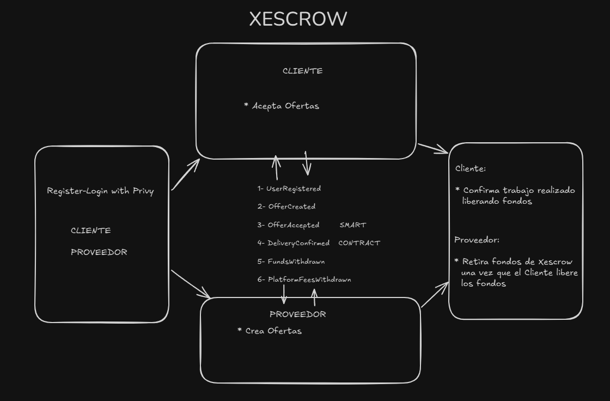
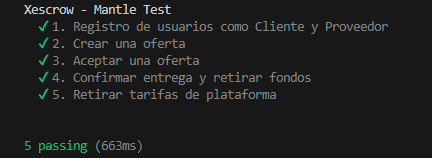
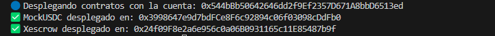

Se creo Xescrow como una plataforma descentralizada para contratar y asegurar servicios laborales entre clientes y proveedores, utilizando tokens de Test de Mantle Sepolia en la red Mantle Testnet para el hackathon de Odisea Nucleo, como es una beta experimental y comienzo del proyecto final se reducieron a algunas funciones el smart contract. Xescrow Buscará solucionar un problema real como la falta de confianza, pagos no garantizados y la dependencia de intermediarios.

📦 Para ejecutar el proyecto:
*******************************

npm install del lado de front como en la raíz

npm run dev

Aclaración, el front-end te permitirá:

-Registro de usuarios como Cliente o Proveedor
-Creación de ofertas laborales con descripción IPFS
-Aceptación de ofertas con pago en token (simula USDC)
-Confirmación de entrega y retiro de fondos
-Retiro de tarifas acumuladas por la plataforma

✅  Verificación de Smart contract Xescrow
*******************************

https://sepolia.mantlescan.xyz/address/0x518473adD009632e8Ce711a1861424dab03B5d29#code

✅ Test
*******************************

 

✅ Deploy
*******************************

🛠️ Tecnologías usadas
*******************************
Contrato inteligente : Solidity + OpenZeppelin
Testing : Hardhat
Frontend : Next.js + Privy 
Auditoria: NatSpect format 
Token simulado : Mantle Sepolia Testnet

Autores
*******************************
Braulio Chávez
Diego Raúl Barrionuevo

Agradecimientos
*******************************
A Rafa por el compromiso como profesor y las sesiones dedicadas a dudas planteadas en el trabajo
Al equipo de Odisea Nucleo por hacer posible este evento.
